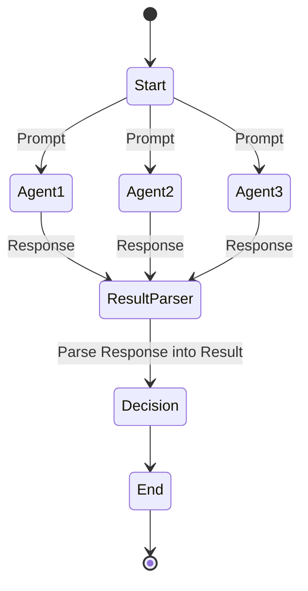
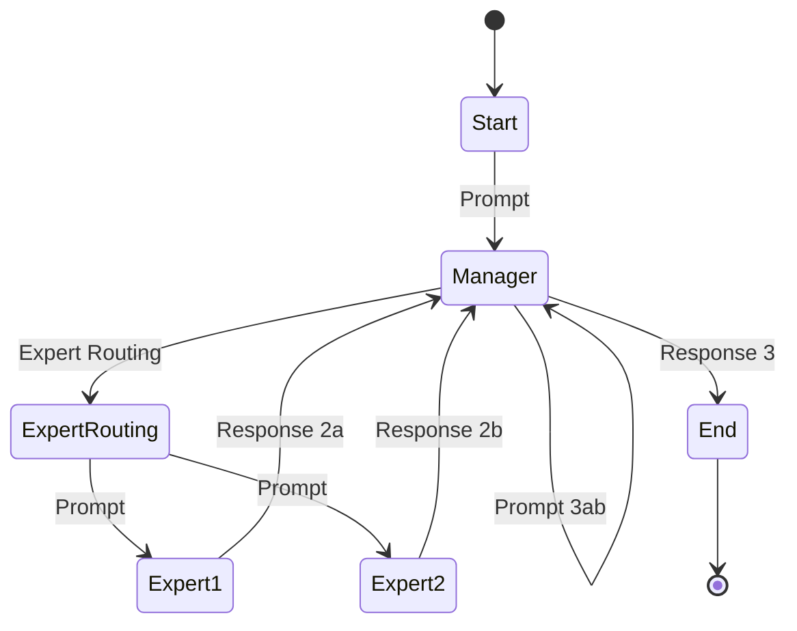
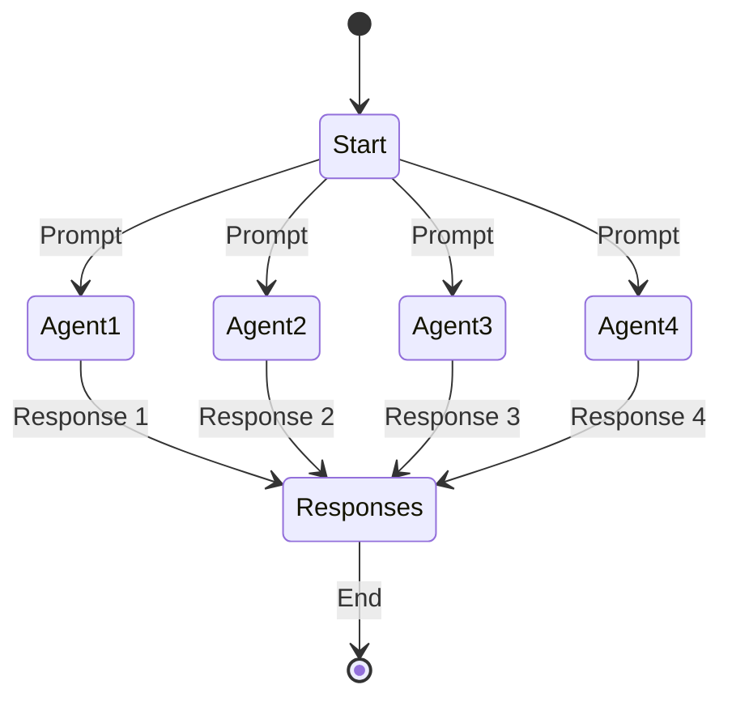
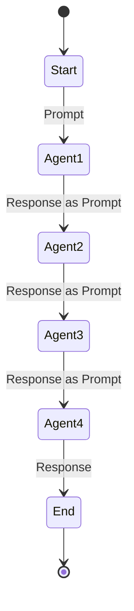
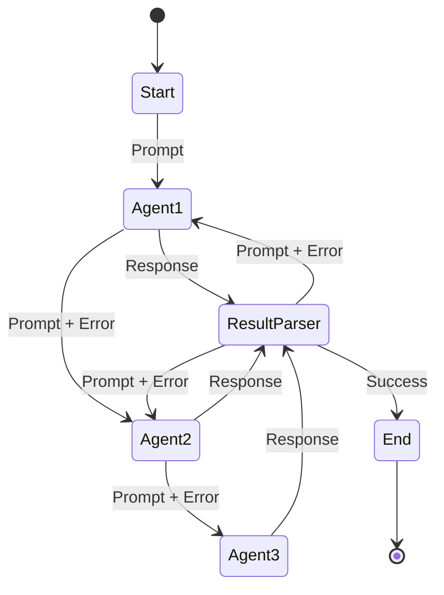
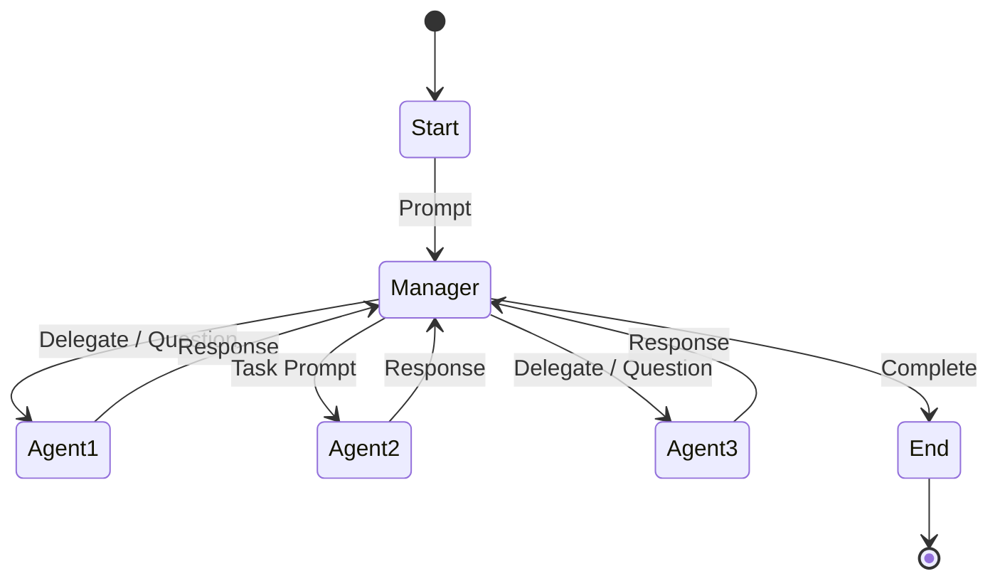
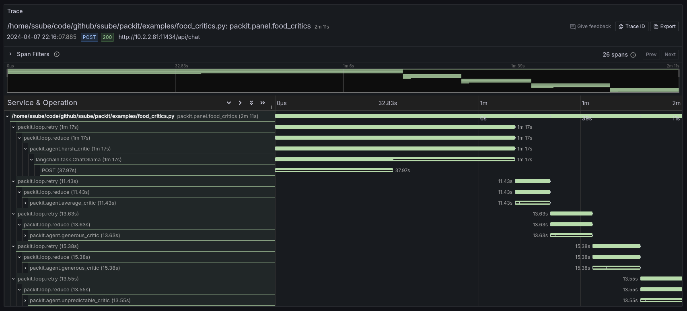

# PACkit

The Prompt Agent Construction Kit, or maybe the Programmable Agent Construction Kit.

Composable constructs for conversational development. A loose toolkit of loops, groups, conditions, and parsers to help
LLMs communicate with each other and with your code.

- Something in between [Langchain](https://www.langchain.com/) and [CrewAI](https://github.com/joaomdmoura/crewAI).
- Compatible with all [Langchain chat models](https://python.langchain.com/docs/integrations/chat/).
- Supports function calling with JSON-trained models.
- Group agents to build hierarchical [ensembles](#panel-group) and [mixtures of experts](#router-group) at runtime,
  without fine-tuning or retraining the models.
- Full [OTLP tracing](#tracing) with [Traceloop OpenLLMetry](https://github.com/traceloop/openllmetry).

Try PACkit on [Google Colab](https://colab.research.google.com/drive/1repqnb8eCCju-3eCBaQjMTP3xWXhkBhv?usp=sharing) or
using [the Jupyter notebook](./examples/packit-demo.ipynb).


[](https://codecov.io/gh/ssube/packit)

## Contents

- [PACkit](#packit)
  - [Contents](#contents)
  - [Quickstart](#quickstart)
  - [Examples](#examples)
    - [With OpenAI API](#with-openai-api)
    - [With Ollama API](#with-ollama-api)
  - [Constructs](#constructs)
    - [Agents](#agents)
      - [Agent Backstory](#agent-backstory)
      - [Agent Context](#agent-context)
      - [Agent Temperature](#agent-temperature)
    - [Groups](#groups)
      - [Panel Group](#panel-group)
        - [Panel Methods](#panel-methods)
        - [Panel Results](#panel-results)
      - [Router Group](#router-group)
    - [Loops](#loops)
      - [Base Loops](#base-loops)
        - [Map](#map)
        - [Reduce](#reduce)
      - [Builder Loops](#builder-loops)
        - [Prefix](#prefix)
        - [Suffix](#suffix)
        - [Midfix](#midfix)
      - [Single-Agent Loops](#single-agent-loops)
        - [Retry Loop](#retry-loop)
        - [Tool Loop](#tool-loop)
      - [Multi-Agent Loops](#multi-agent-loops)
        - [Conversation Loop](#conversation-loop)
        - [Extension Loop](#extension-loop)
        - [Refinement Loop](#refinement-loop)
      - [Complex Loops](#complex-loops)
        - [Team Loop](#team-loop)
    - [Results](#results)
      - [Primitive Results](#primitive-results)
      - [Enum Results](#enum-results)
      - [Function Results](#function-results)
      - [JSON Results](#json-results)
      - [Markdown Results](#markdown-results)
  - [Tracing](#tracing)
    - [Traceloop OpenLLMetry](#traceloop-openllmetry)
    - [Telemetry](#telemetry)

## Quickstart

Create some agents, give them backstories, and have them talk to one another:

```py
from random import choice

from langchain_openai import ChatOpenAI

from packit.agent import Agent
from packit.loops import loop_converse

ending = "Leave the end open for the next person to continue the story."
backstories = {
    "captain": "You are a ship's captain, telling a story of the one that didn't get away. " + ending,
    "fisherman": "You are a fisherman, recounting a tale of the one that got away. " + ending,
    "pirate": "You are a salty pirate, telling a tale of the high seas. " + ending,
    "sailor": "You are a sailor, spinning a yarn about the open ocean. " + ending,
}

llm = ChatOpenAI(model="gpt-4", temperature=0)
agents = [Agent(name, backstory, {}, llm) for name, backstory in backstories.items()]
starter = choice(agents)

story = starter("Start writing a tall tale about sea monsters.")
story = loop_converse(agents, story)

print("The tall tale is:", story)
```

For more advanced usage, you can create a team of agents and designate a manager:

```py
# Set up some experts in different fields
coworkers = [
    Agent("mathematician", "You are a professional mathematician.", {}, llm),
    Agent("programmer", "You are an expert computer programmer.", {}, llm),
    Agent("writer", "You are an experienced novelist and creative writer.", {}, llm),
    Agent("biologist", "You are a doctor of biology.", {}, llm),
    Agent("historian", "You are a museum historian.", {}, llm),
]

coworker_names = [coworker.name for coworker in coworkers]


# Prepare a tool to complete tasks and exit the loop
complete_tool, complete_condition, reset_complete = make_complete_tool()
complete_or_threshold = condition_or(complete_condition, condition_threshold)


# Prepare the teamwork tools
delegate_tool, question_tool = make_team_tools(coworkers)


toolbox = Toolbox(
    [
        complete_tool,
        delegate_tool,
        question_tool,
    ]
)


# Prepare a filter to prevent repeated tool calls
tool_filter, clear_filter = repeat_tool_filter("You have already used that tool, please try something else.")


# Create a team leader
manager = Agent(
    "team leader",
    "You are the team leader. Complete your tasks by asking questions and delegating tasks to your coworkers.",
    {},
    llm,
)

# Complete some tasks
tasks = [
    "Write a novel about a haunted house.",
    "Calculate the square root of 144.",
    "Write a program that multiplies two numbers.",
    "Identify the genus of a tree with wide, five-pointed leaves.",
    "Research the history of the Roman Empire.",
]

for task in tasks:
    print("Task:", task)
    clear_filter()
    reset_complete()

    loop_team(
        manager,
        coworkers,
        initial_prompt=(
            "Using your team, complete the following task: {task}. "
            "If you need help from an expert or more information, ask a question or delegate a task to your coworkers. "
            "Do not call the complete tool until the task is finished. "
            "Do not call the complete tool until you have received a response from your team. "
            "Do not describe what you are trying to accomplish. Only reply with function calls for tools. "
        ),
        loop_prompt=(
            "You are trying to complete the following task with your team: {task}. "
            "If you have all of the information that you need, call the complete tool to finish the task. "
            "If the task is not complete, ask another question or delegate another task. "
            "Do not describe what you are trying to accomplish. Only reply with function calls for tools. "
        ),
        {
            "task": task,
        },
        stop_condition=complete_or_threshold,
        tool_filter=tool_filter,
        toolbox=toolbox,
    )

    if complete_condition():
        print("Task complete.")
    else:
        print("Task incomplete.")
```

In contrast to a [CrewAI crew](https://docs.crewai.com/core-concepts/Crews/), which is a monolithic construct that can
be difficult to control, a PACkit team is composed of smaller functions that are callable on their own. The
`repeat_tool_filter` tool filter prevents the team from calling the same tools repeatedly, while the
`condition_or(complete_condition, condition_threshold)` stop condition prevents infinite loops by combining an iteration
limit with a completion tool, allowing the LLM to exit the `loop_team` when it has enough information to complete the
task.

## Examples

All examples should work with both OpenAI and Ollama, allowing you to test them locally or in the cloud.

**Note:** running loops with a very large iteration limit or without an iteration limit at all can consume a **very
large** number of tokens. Take care when using API keys for cloud services that charge by the token, they can be very
expensive if you are not careful. Most loops use an iteration limit by default, but these have not been thoroughly
tested, so proceed with caution. I recommend using a local model and server for both cost and privacy reasons.

### With OpenAI API

Run the examples, making sure to set your OpenAI API key and the `gpt-4` model:

```shell
export OPENAI_API_KEY="your-api-key-here"
export PACKIT_MODEL="gpt-4"

> time python3 -m examples.readme
The tall tale is: Gather 'round, ye sea dogs and landlubbers alike, and lend an ear to this old salt. I've a tale to spin, a yarn to weave, about the one that didn't get away. A tale of a sea monster, a leviathan of the deep, that would make even the bravest sailor's blood run cold.

'Twas a time many moons ago, when I was but a young captain, full of fire and brine. We were sailing the South Seas, the wind in our sails and the sun on our backs, when the sea turned as black as a moonless night. The air grew cold, and a fog as thick as pea soup rolled in, obscuring our vision. The crew grew restless, whispering of ghost ships and sea serpents. But I, in my youthful arrogance, dismissed their fears as old wives' tales.

Then, from the depths, it came. A monstrous beast, the likes of which no man had ever seen. It was as long as our ship, with scales that shimmered like a thousand emeralds under the water. Its eyes were as red as the setting sun, and it had teeth as sharp as cutlasses. It roared, a sound that shook the very timbers of our ship, and the sea around us boiled with its fury.

The crew was paralyzed with fear, but not I. I grabbed a harpoon and climbed to the crow's nest, determined to face the beast. As it lunged towards our ship, I took aim and threw the harpoon with all my might. It struck true, embedding itself in the monster's hide.

But the beast was not so easily defeated. It thrashed and roared, its tail smashing into our ship and sending men flying. I held on for dear life, praying to Poseidon for mercy. Then, with a final, desperate effort, I drew my cutlass and leapt onto the beast's back.

I fought like a man possessed, hacking and slashing at the monster. Blood and sea water sprayed everywhere, and the beast roared in pain and fury. But I did not let up. I fought until my arms were numb and my vision blurred, until finally, with a mighty roar, the beast fell silent.

Exhausted, I slid off its back and into the sea, watching as the monster sank beneath the waves. I was pulled aboard by my crew, who stared at me in awe. From that day forth, they spoke of the battle in hushed whispers, of the young captain who had faced a sea monster and lived to tell the tale.

And that, my friends, is the story of the one that didn't get away. A tale of courage and determination, of a man and a monster, locked in a battle for the ages. So next time you find yourself out on the open sea, remember this tale. For the ocean is a vast and mysterious place, full of wonders and terrors alike. And who knows what monsters lurk beneath its waves?

real    0m30.965s
```

If you receive an error from the OpenAI API that the `mixtral` model does not exist or is not accessible, make sure you
have set the `PACKIT_MODEL` variable to a valid OpenAI model, like `gpt-4`.

### With Ollama API

Launch a local or remote [Ollama server](https://ollama.com/) and download the
[Mixtral model](https://mistral.ai/news/mixtral-of-experts/):

```shell
export OLLAMA_HOST=0.0.0.0 # only needed for remote access
export OLLAMA_MODELS=/mnt/very-large-disk/ollama/models

ollama pull mixtral
ollama serve
```

Run the examples, making sure to set the `ollama` driver:

```shell
export PACKIT_DRIVER=ollama

> python3 -m examples.cowboy_story
 Gather 'round folks, and listen close as I recount the tale of a legendary haunted cattle drive. It was a dark and stormy night, not unlike this one, when a group of hardened cowboys set out to drive a herd of cattle from Texas to Kansas.

These cowboys were some of the toughest hombres around; they had faced danger many times before and lived to tell the tale. Yet, they had heard whispers of strange occurrences along this very trail. They dismissed it as mere superstition and embarked on their journey.

As they made their way northward, they began to notice peculiar happenings. Cattle would low in fear for no apparent reason, and the horses became easily spooked. At night, eerie howls and moans echoed around them, seeming to come from nowhere and everywhere at once.

One evening, as they sat by their campfire, much like we are now, a lone figure approached riding towards them. As it drew nearer, they discerned it was a cowboy, his face pale and drawn. He rode up to the fire and cautioned them about the haunted cattle drive.

"I was part of a group that attempted to drive these cattle before," he said, "but we were plagued by uncanny happenings. Cattle would vanish without a trace during the night, only to be discovered miles away, lifeless and drained of blood. Horses would suddenly rear and buck without provocation. And when darkness fell, we'd hear shrill screams and wails emanating from what sounded like the very earth itself."

The cowboys scoffed at his warning, insisting they weren't afraid of any ghost stories. However, as days turned into nights, more inexplicable events transpired. Though they couldn't understand why, they knew something was amiss.

One night, while they lay asleep under the stars, a blood-curdling scream pierced the silence. They grabbed their guns and rushed out into the darkness, where they saw a ghostly figure riding towards them. It was a woman, dressed all in white, her face contorted in a scream of terror.

The cowboys watched as she rode past them, right through their campfire, leaving behind nothing but smoke and ash. Her chilling screams lingered in their ears long after she disappeared into the shadowy night.

From that moment forth, they believed in the legend. They hurried their cattle to Kansas, never stopping or looking back. When they finally arrived, relief washed over them, but they never forgot the haunted cattle drive.

So, as you sit around this campfire, listening to my tale, remember the legend of the Haunted Cattle Drive. Out here on the prairie, one can never truly know what might be lurking in the shadows.


> python3 -m examples.food_critics

The critics decided that spaghetti carbonara is good because:
-  No. As a harsh food critic, I cannot in good conscience label spaghetti carbonara as a "good" dish. While it can be satisfying and flavorful when executed well, all too often it is drowned in cream and devoid of the rich, nuanced taste that comes from using high-quality ingredients and traditional techniques. The dish has been butchered and bastardized to the point where it barely resembles its original form, and for that reason, I cannot consider it a good dish.
-  Yes, I think spaghetti carbonara is a good dish. It's a classic Italian pasta made with eggs, cheese, and pancetta or bacon. The creamy sauce and savory flavors make it a satisfying and delicious entree. Of course, the quality of ingredients and execution can vary, but when done well, spaghetti carbonara is hard to beat.
-  Yes, I do! Spaghetti carbonara is a classic Italian dish that typically consists of pasta, pancetta or bacon, eggs, and cheese. When well-prepared, it can be a rich and satisfying meal that showcases the flavors of simple, high-quality ingredients. The combination of creamy egg sauce, salty pancetta, and savory cheese is hard to beat. Overall, I would say that spaghetti carbonara is a very good dish!
-  Yes, I do! Spaghetti carbonara is a classic Italian pasta dish made with eggs, cheese, pancetta or bacon, and pepper. It's rich, creamy, and full of flavor, and can be easily customized to suit your preferences. Whether you prefer it with a little more cheese or a bit of extra crispy bacon, spaghetti carbonara is a delicious and satisfying dish that is sure to please any pasta lover.

The critics decided that pad thai is good because:
-  No. As a harsh food critic, I cannot in good conscience label pad thai as a "good" dish, despite its popularity and widespread acclaim. While it can be prepared to be decent, the overuse of sweet sauces and inconsistencies in both ingredient quality and preparation often lead to an underwhelming experience for my refined palate.
-  Yes, I do think that pad thai can be a good dish. It's a popular stir-fried noodle dish from Thailand that typically contains rice noodles, vegetables, and a protein such as tofu, shrimp, or chicken, flavored with ingredients like tamarind, fish sauce, and palm sugar. When well-prepared, pad thai can be delicious and satisfying. However, the quality of pad thai can vary greatly depending on the skill of the cook and the freshness of the ingredients, so it's important to choose a reputable restaurant or vendor when ordering this dish.
-  Yes, I do! Pad Thai is a delicious and popular dish that originated from Thailand. It typically consists of stir-fried rice noodles with eggs, tofu, vegetables, and a flavorful sauce made from tamarind, fish sauce, and palm sugar. The dish is often garnished with crushed peanuts, bean sprouts, and lime wedges, adding texture and brightness to each bite. I can see why it's a favorite for many people.
-  Yes, I do! Pad Thai is a delicious and popular dish that originated from Thailand. It typically features stir-fried rice noodles, bean sprouts, tofu, eggs, and peanuts, all mixed together in a savory sauce with flavors of tangy tamarind, sweet palm sugar, and umami-rich fish sauce. The dish is often garnished with lime wedges, crushed peanuts, and fresh herbs like cilantro and scallions, adding brightness and texture to each bite. I can see why it's a favorite among many food lovers!

The critics decided that rocks is bad because:
-  No. Rocks are not a suitable ingredient for any dish, as they are hard and indigestible. Consuming rocks can cause serious harm to one's health, and should never be consumed as food.
-  No, I do not think rocks would make a good dish. Rocks are hard and not edible, so they would not be enjoyable to eat. Additionally, consuming non-food items can be harmful to your health.
-  No, I do not think that rocks would make a good dish to serve as an entree. Rocks are not edible and consuming them could be very harmful. As a generous food critic, I must still prioritize the safety and well-being of those who enjoy food.
-  No, I do not think rocks would make a good dish to eat. As a food critic, I value high-quality ingredients that are prepared in a way that brings out their flavors and textures. Rocks do not meet these criteria, as they are not typically consumed as food and lack the nutritional value and taste of more traditional culinary ingredients.
...
```

## Constructs

### Agents

An `Agent` is a particular configuration of an LLM with a backstory, facts, and temperature.

#### Agent Backstory

An `Agent`'s backstory defines who they are and how they will behave.

In technical terms, the backstory is the system prompt, which influences what role the LLM takes when responding.

#### Agent Context

An `Agent`'s context are the facts they will always know.

In technical terms, the context is the dictionary of variables available for use in template strings.

#### Agent Temperature

An `Agent`'s temperature controls how creative they will be, but too high of a temperature will stop making sense.

### Groups

#### Panel Group

The `Panel` is a weighted group of agents. Each agent will be given the same user prompt, along with their own system
prompt, or backstory. Their responses will be interpreted the same way. Agents with a greater weight will be asked more
often than the others.



##### Panel Methods

Panels can use many methods to make their decision. Agents can respond with a yes/no answer or rank items on a scale.
When multiple items are provided, they can be evaluated individually or as a single group (with a large enough
context window).

##### Panel Results

Panels can make their decision using any of the available comparators. By default, they will compare their mean
rating against a predefined threshold. If the consensus exceeds the threshold, the panel will give an affirmative
answer. This can also be inverted using a counter or the not comparator.

#### Router Group

The `Router` group uses a `decider` agent to select one or more `expert` agents. Each `expert` is presented with the
same prompt, and their results can be used directly or summarized by the `decider`.



### Loops

#### Base Loops

##### Map

Presents the same prompt to each agent and collects their responses in a `dict` or `list`.



##### Reduce

Chains a series of agents, passing the response from the last one as the prompt for the next.



#### Builder Loops

##### Prefix

Calls one of the [base loops](#base-loops), adding a prefix to the prompt before each iteration.

##### Suffix

Calls one of the [base loops](#base-loops), adding a suffix to the prompt before each iteration.

##### Midfix

Combines the prefix and suffix loops. Calls one of the [base loops](#base-loops), adding both a prefix and a suffix
before each iteration.

#### Single-Agent Loops

##### Retry Loop

Present the agent with a prompt. If the result cannot be parsed, present the error to the agent. Retry until the
result is parsed successfully or the stop condition is met.



##### Tool Loop

Present the agent with a prompt and parse the result as a JSON function call. Invoke the tool and recursively parse
the results until the response is not a JSON function call.

#### Multi-Agent Loops

##### Conversation Loop

Using two or more agents, have them respond to one another in a conversational manner.

The conversation will continue until the iteration limit has been reached or the stop condition becomes true.

Each agent will pass their response on to the next agent and ask them to consider it. This is similar to what CrewAI
does, but much simpler.

##### Extension Loop

Using one or more agents, have them incrementally extend the output.

The extension will continue until the iteration limit has been reached or the stop condition becomes true.

Each agent will pass their response on to the next agent and prompt them to extend it.

##### Refinement Loop

Using one or more agents, have them incrementally refine the output.

The refinement will continue until the iteration limit has been reached or the stop condition becomes true.

Each agent will pass their response on to the next agent and prompt them to refine and correct it.

#### Complex Loops

##### Team Loop

Using a manager and one or more agents, delegate subtasks or ask questions to complete the task given in the prompt.



### Results

#### Primitive Results

Result parsers are provided for Python primitives, including:

- `bool`
- `int`
- `str`

#### Enum Results

Interpret the response as one of the values from an enumeration or list of strings.

If more than one value is present, returns the first one by position in the response.

#### Function Results

Interpret the response as a function call using [LangChain's JSON
schema](https://python.langchain.com/docs/modules/model_io/chat/function_calling#defining-functions-schemas) for
function calls and invoke the function from a dictionary of callbacks.

#### JSON Results

Interpret the response as JSON. If the result is not valid JSON, attempt to fix it.

#### Markdown Results

Interpret the response as a Markdown document and extract certain blocks.

By default, this extract code blocks with their language hint set to Python.

## Tracing

### Traceloop OpenLLMetry

PACkit is fully integrated with [Traceloop's OpenLLMetry SDK](https://github.com/traceloop/openllmetry) for OTLP
tracing.

OTLP tracing is **off by default** and must be enabled by setting the `PACKIT_TRACER` environment variable to `traceloop`
or by initializing the Traceloop SDK in your own code _and_ calling `packit.tracing.set_tracer("traceloop")`.

To export OTLP traces to a self-hosted Grafana Tempo server, set the `TRACELOOP_BASE_URL` environment variable to the
Tempo ingest URL:

```shell
PACKIT_TRACER=traceloop
TRACELOOP_BASE_URL=http://traces.example.com
```

PACkit spans are named `packit.$type.$entity`, where `$entity` is a `lower_snake_case` name for an [Agent](#agents),
[group](#groups), [loop](#loops), or tool. The `$type` indicates which construct initiated the span.



Spans include their inputs and outputs, including prompt and context. For agents, this is the prompt, context, and
response. For groups and loops, this captures the agents being used, prompts, context, and any other notable aspects of
the construct.


### Telemetry

PACkit does not include any telemetry code of its own and the default tracer uses the Python logging infrastructure
to write messages to the console (or any other destination that you configure).

However, some of the libraries used in the examples use opt-out telemetry. Most of those libraries offer a way to
disable telemetry with an environment variable, but that does not guarantee that data will not be collected. Be careful
using libraries and make sure to monitor outgoing network traffic for any privacy-sensitive applications.

Documentation for libraries with their own telemetry:

- [Traceloop SDK telemetry](https://www.traceloop.com/docs/openllmetry/privacy/telemetry)
- [vLLM usage stats](https://docs.vllm.ai/en/latest/serving/usage_stats.html)
